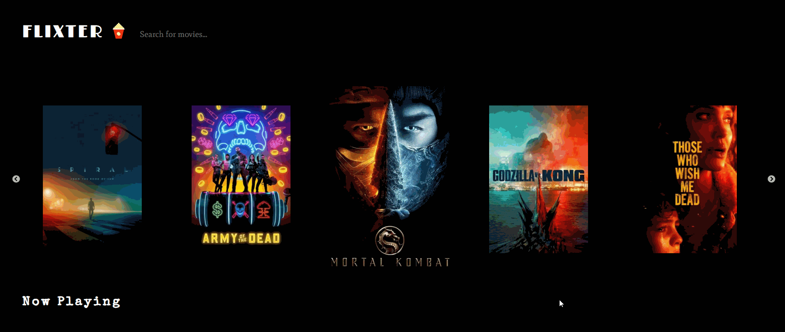
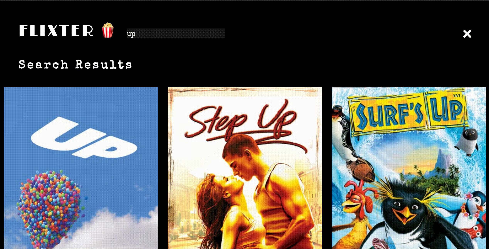

## Week 1 Assignment: Flixster

Submitted by: **Stella Kim**

Estimated time spent: **15** hours spent in total

Deployed Application (optional): [Flixster Deployed Site](https://stellakim-flixter.netlify.app/)

### Application Features

#### REQUIRED FEATURES

- [x] User can view a list of current movies from The Movie Database API as a grid view.
- [x] For each movie displayed, user can see the following details: `Title`, `Poster Image`, `Votes`.
- [x] User can load more current movies by clicking a button at the bottom of the list. The page should not refresh; movies should simply be added to the bottom.
- [x] Allow users to search for movies and display them in a grid view. Users should be able to clear results and view previous current movies displayed.
- [x] Website accounts for basic HTML/CSS accessibility features.
- [x] Website should be responsive.

#### STRETCH FEATURES

- [x] Deploy website using GitHub Pages. (Netlify) 
- [x] Allow user to view more details about a movie within a popup.
- [x] Improve the user experience through CSS & animation. 
- [x] Implemented a slider carousel to display now playing movies (movie posters).
- [x] Clear search input value when returning back to now playing movies home screen.
- [x] Mobile Responsiveness.

### Walkthough GIF

- Showcasing the slider carousel of Now Playing & Popular Movie Posters (images)

- Showcasing the grid of Now Playing Movies that features movie details such as the movie's title, poster image, and votes

- Showcasing the load more button for Now Playing Movies

- Showcasing the search bar and grid display of searched movies

- Showcasing the load more button for searched movies

- Showcasing the clear searched results & clearing search input field value

- Showcasing the pop up modal box which displays more details about the movie on click

- Showcasing hover effect animation on movie poster images

- Showcasing responsiveness

### Reflection

* Did the topics discussed in your labs prepare you to complete the assignment? Be specific, which features in your weekly assignment did you feel unprepared to complete?

Add your response here

* If you had more time, what would you have done differently? Would you have added additional features? Changed the way your project responded to a particular event, etc.
  
Add your response here

* Reflect on your project demo, what went well? Were there things that maybe didn't go as planned? Did you notice something that your peer did that you would like to try next time?

Add your response here

### Open-source libraries used

- Add any links to open-source libraries used in your project.

### Shout out

Give a shout out to somebody from your cohort that especially helped you during your project. This can be a fellow peer, instructor, TA, mentor, etc.
